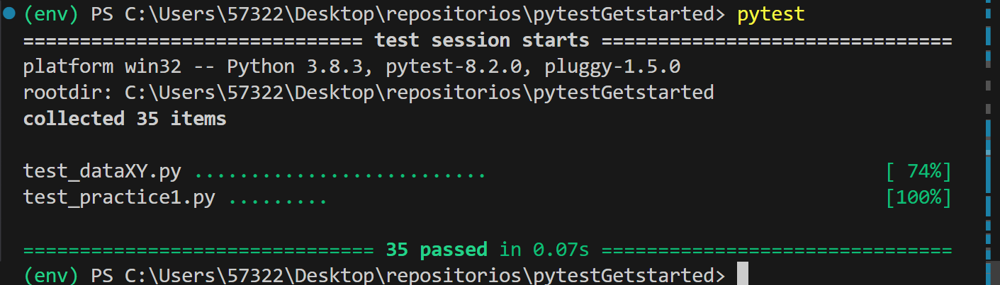

# Pytest Getstarted

Pytest es un marco que facilita la escritura de pruebas pequeñas y legibles que 
pueden escalarse a pruebas funcionales complejas para aplicaciones y bibliotecas. 
Este repositorio empezará como un cuaderno de apuntes sobre el tema y terminará como una una guía de aprendizaje de Pytest. 


## Evidencia de ejecusión exitosa



## Documentación técnica

### Configuración rápida del entorno de desarrollo
| Paso   | Descripción                     | comando                             |
| :----  | :----                           | :---                                |
| Paso 1 | Crear el entorno de trabajo     | python -m venv env                  |
| Paso 2 | Activar el entorno de trabajo   | ./env/Scripts/activate              |
| Paso 3 | Facilitar pruebas unitarias     | python -m pip install --upgrade pip |
| Paso 4 | Preparar la receta de librerías | pip install -r requirements.txt     |

### Librerías del proyecto
| librería | Descripción                 | Comando               |
| :----    | :---                        | :---                  |
| fpdf2    | Facilita pruebas unitarias  | pip install -U pytest |

Con la instalación de la librería pytest se instalarán los siguientes paquetes. 
```CMD
colorama==0.4.6  
exceptiongroup==1.2.1  
iniconfig==2.0.0  
packaging==24.0  
pluggy==1.5.0  
pytest==8.2.0  
tomli==2.0.1  
```

### Realice sus pruebas, actualizaciones o modificaciones
Puedes actualizar, contribuir y mejorar el presente código fuente, es licencia GNU v3. Por norma internacional debes conservar el mismo tipo de licencia. No está permitido modificar la licencia de trabajos derivados de este proyecto.  

### Mantenimiento de la configuración rápida
Si agregas nuevas librerías al proyecto, no olvides actualizar la receta.
| Paso   | Descripción                   | comando                       |
| :----  | :----                         | :---                          |
| Paso 1 | Crear el entorno de trabajo   | python -m venv env            |
| Paso 2 | Activar el entorno de trabajo | ./env/Scripts/activate        |
| Paso 3 | Facilitar pruebas unitarias   | pip install -U pytest         |
| Paso 4 | Actualizar la receta          | pip freeze > requirements.txt |

### Comprobar que todo está en orden
| Paso   | Descripció | comando |
| :----  | :----      | :---    |
| Paso 1 | Desactive el entorno de trabajo  | deactivate |
| Paso 2 | Elimine el entorno anterior      | rm -R env |
| Paso 3 | Cree un entorno de python        | python -m venv env |
| Paso 4 | Active el entorno de trabajo     | ./env/Scripts/activate |
| Paso 5 | Actualice el gestor de paquetes  | python -m pip install --upgrade pip |
| Paso 6 | Instale las librerías necesarias | pip install -r requirements.txt |
| Paso 7 | Realice las pruebas unitarias    | pytest |
| Paso 8 | Finalice su gestión              | deactivate |
